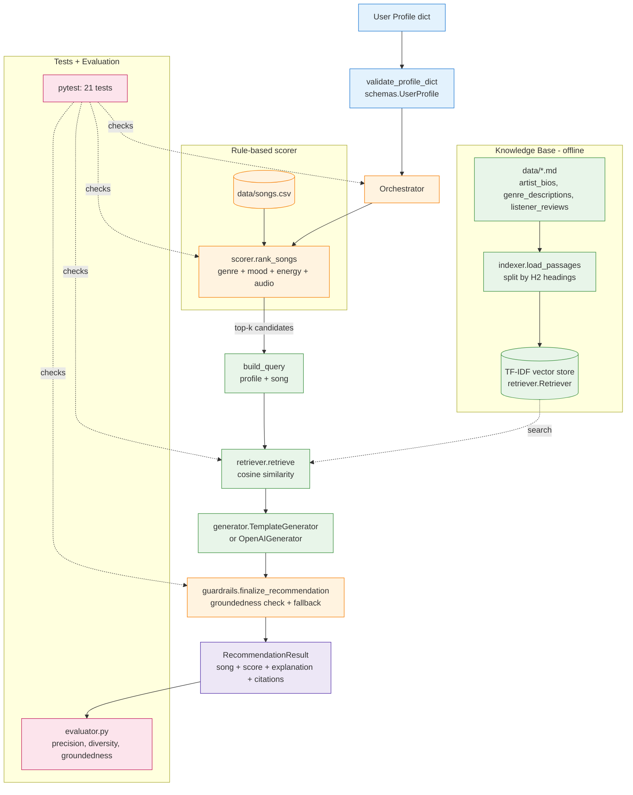

# VibeFinder 2.0 — RAG-Enhanced Music Recommender

A music recommender that combines a transparent rule-based scorer with a
**Retrieval-Augmented Generation (RAG)** pipeline. Every recommendation ships
with a grounded, cite-able explanation drawn from a small multi-source
knowledge base (artist bios, genre descriptions, listener reviews).

This project extends a prior class project,
[`ai110-module3show-musicrecommendersimulation-starter`](https://github.com/anonymousminh/ai110-module3show-musicrecommendersimulation-starter),
which scored songs from a CSV against a user profile using fixed weights.
VibeFinder 2.0 keeps that scorer as the baseline and layers a real RAG
pipeline on top of it, plus reliability guardrails and an evaluation harness.

---

## What's New vs the Base Project

| Layer | Base (v1) | VibeFinder 2.0 |
|---|---|---|
| Recommendation | rule-based score → top-k | rule-based score → RAG explanation → guardrail check |
| Output | song + numeric score | song + score + grounded explanation + citations |
| Inputs | dict | Pydantic-validated profile (input guardrail) |
| Knowledge | songs.csv only | songs.csv + 3 markdown sources (multi-source RAG) |
| Reliability | none | input validation, retrieval fallback, groundedness check |
| Testing | starter tests | 21 tests (unit + integration) + evaluation harness |

---

## System Architecture



This diagram matches the actual code: every named node corresponds to a
function, class, or module in `src/`.

---

## Project Structure

```
applied-ai-system/
├── README.md
├── reflection.md
├── model_card.md
├── requirements.txt
├── pytest.ini
├── .env.example
├── demo.py                  # end-to-end demo runner
├── evaluator.py             # evaluation harness (rubric stretch)
├── data/
│   ├── songs.csv
│   ├── artist_bios.md
│   ├── genre_descriptions.md
│   └── listener_reviews.md
├── examples/
│   └── demo_profiles.json   # 5 sample profiles
├── src/
│   ├── schemas.py           # Pydantic models
│   ├── scorer.py            # rule-based scorer (carried over from v1)
│   ├── indexer.py           # markdown -> Passage list
│   ├── retriever.py         # TF-IDF retriever
│   ├── generator.py         # template + optional LLM generator
│   ├── guardrails.py        # validation, groundedness, fallback
│   ├── orchestrator.py      # ties everything together
│   └── main.py              # CLI entry
└── tests/
    ├── test_scorer.py
    ├── test_retrieval.py
    ├── test_pipeline.py
    └── test_guardrails.py
```

---

## Setup

```bash
python3 -m venv .venv
source .venv/bin/activate         # Windows: .venv\Scripts\activate
pip install -r requirements.txt
cp .env.example .env              # optional - only needed for the LLM backend
```

The default generator is fully offline (template-based). If you want to use
OpenAI, set:

```
OPENAI_API_KEY=sk-...
USE_LLM=true
LLM_MODEL=gpt-4o-mini
```

The pipeline behaves identically with either backend; the OpenAI generator
falls back to the template generator if the API call fails.

---

## Run

### End-to-end demo (5 profiles)

```bash
python demo.py
```

### Single profile via CLI

```bash
python -m src.main --genre lofi --mood calm --energy 0.3 --acoustic
python -m src.main --profile examples/demo_profiles.json
```

### Tests

```bash
pytest
```

### Evaluation harness

```bash
python evaluator.py
```

---

## Sample Input → Output

**Input** (one entry from `examples/demo_profiles.json`):

```json
{
  "name": "Chill Lofi",
  "favorite_genre": "lofi",
  "favorite_mood": "calm",
  "target_energy": 0.3,
  "likes_acoustic": true
}
```

**Output** (abbreviated):

```
Profile: Chill Lofi | genre=lofi mood=calm energy=0.30 acoustic=True
--------------------------------------------------------------------
  #1 Coffee Steam - Soft Static  [score=6.32, grounded=True]
      'Coffee Steam' by Soft Static fits because its lofi genre matches your
      preference, and its calm mood lines up with what you want, and its
      energy (0.32) closely matches your target (0.30). Context: "Lighter
      than Library Rain [listener_review:coffee-steam-soft-static]. Context:
      Soft Static is a lofi project blending warm tape hiss... [artist_bio:soft-static].
      citations: listener_review:coffee-steam-soft-static, artist_bio:soft-static

  #2 Library Rain - Soft Static  [score=6.28, grounded=True]
      ...
```

Every line beginning with `Context:` is sourced from a retrieved passage and
the `citations:` line lists the passage IDs that the explanation actually
references.

---

## Reliability and Guardrails

Three layered checks (`src/guardrails.py`):

1. **Input validation** — `validate_profile_dict` rejects malformed input
   (missing fields, out-of-range numerics) and warns on unknown genres/moods.
2. **Retrieval fallback** — `retrieval_is_usable` triggers the fallback path
   if no passage exceeds a similarity threshold, so the system never invents
   context.
3. **Groundedness check** — `check_groundedness` verifies that every shipped
   explanation cites at least one passage that actually came back from the
   retriever. If not, the explanation is replaced with a conservative
   feature-only fallback.

Examples of guardrail behavior:

```bash
# Hard rejection (target_energy out of range)
python -m src.main --genre pop --mood happy --energy 5.0

# Soft warning (genre not in catalog)
# See "Edge: K-Pop" profile in demo.py output - retrieval still works
# via mood + energy similarity.
```

---

## Stretch Features Implemented

- **Multi-source retrieval** — three knowledge-base files of different types
  (`artist_bios.md`, `genre_descriptions.md`, `listener_reviews.md`) are all
  indexed; citations show which source each claim came from. The retriever
  also supports filtering to a subset of source types.
- **Test harness / evaluation script** — `evaluator.py` runs all benchmark
  profiles and prints precision@k, diversity@k, groundedness, and a
  per-profile pass/fail verdict against configurable thresholds.

See `reflection.md` for what worked, what AI suggestions misfired, and what
I'd improve next.
